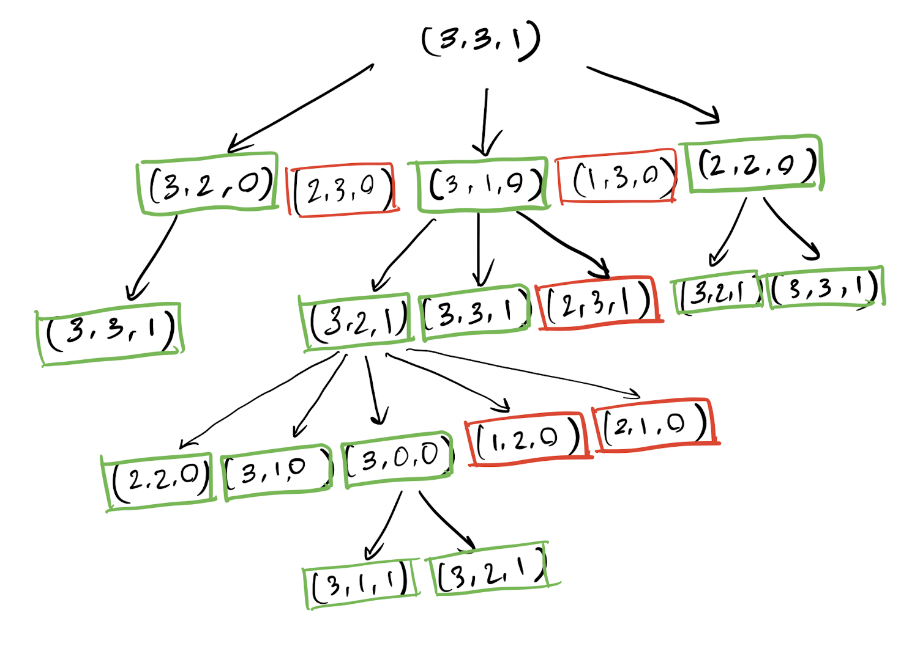
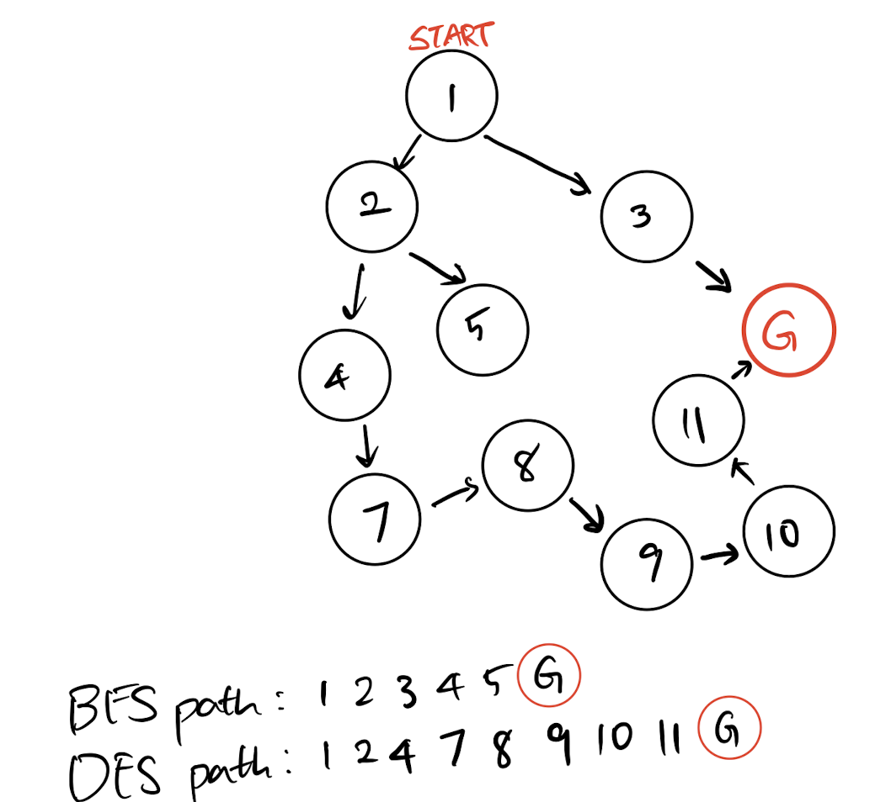

# CS 76 PA 1 
- Class: COSC 76
- Term: 20F
- Year: '22
- Assignment: PA0
- Name: Tim (Kyoung Tae) Kim 

# Description

## BFS

### Design

`bfs_search` is iterative and makes use of a python deque() to store the frontier nodes (next layer of nodes to be explored) and set() to store all the nodes that have been visited. While there are nodes still to be explored, we add the children (if they exist) of the current node after storing it as a SearchNode object. We continue until we reach on the goal state, upon which we call the backchain function to store the path inside the solution object. Finally, the BFS returns the SearchSolution object that contains the path and its length as well as the toal number of nodes visited. 

### Testing

Comparing the path returned by the BFS algorithm and the graph drawn below (Fig. 1), it seems to reach the correct solution by exploring the appropriate nodes. For instance, it correctly starts from (3, 3, 1) and travels to (3,1,0) to (3,2,1) and then to (3,0,0). Note that the number of nodes visited is much less than the toal legal states (marked in green in Fig. 1) because BFS keeps track of visited nodes and does not visit previously visited nodes. 

## DFS (path-checking)

### Design

`dfs_search` is a path-checking, recursive DFS algorithm. It first creates a SearchNode and SearchSolution object to store the root node and solution respectively if they have not been provided as parameters. The first base case is when the node depth exceeds the depth limit. Note that we still return the SearchSolution object because of how IDS is designed. The second base case is when the current state is the goal, where we call the backchain function to store the solution path. Otherwsie, we add the current state into the path and for each of its children that is not in the path, we increment number of nodes visited and recursively call dfs on the children nodes. If after exploring its children, the solution does not exist, we will pop the current node and move onto the next node. 

### Testing

Comparing SearchSolution returned by path-checking DFS to previously implemented BFS, we can see that for the starting state of (3,3,1) although the solution length is the same (12), the number of nodes visisted is higher at 17 (BFS is 16) as the DFS simply keeps traveling down to the left most path in the graph. In the case for the starting state of (5,4,1), this difference is more noticeable at the solution length of 20 (BFS is 16) and the number of nodes visited at 39 (BFS is 32). 

## IDS 

### Design 

`ids_search` iteratively calls path-checking DFS, with the depth limit given as its parameter. We also provide the SearchSolution and SearchNode object when calling the DFS function. Once DFS returns a solution for its current depth, we check if it has reached the goal state (if the path exists) and return the solution if it does. Otherwise, we keep increasing the depth limit until finally returning the empty solution object if no solution exists. 

### Testing

Comparing SearchSolution returned IDS to path-checking DFS echoes points made in the testing of DFS. For the starting state of (3,3,1) and (5,4,1), the number of nodes visited is quite high at 184 and 1382, as we are potentially visiting the entire graph in each iteration of increased depth. This iterative deepening of the graph essentially functions like a BFS and we can see that the solution lengths of 12 for state (3,3,1) and length of 16 for state (5,4,1) are identical to those of the BFS. 

## Other Design Comments
One last design choice would be related to the `get_successors` function in FoxProblem.py. Depending on the order of successors that are generated and added to the list, there could be slight differences in the solution path and node visited of all three of the algorithms. However, it still wouldn't change the fundamental differences between the three algorithms, such as BFS giving us the shortest possible path. 

# Discussion Questions

## Upper Bound of All States
The possible combination of all states can be obtained by mutiplying the possible combination of animals from 0 to total number + 1 and the two possible location of the boats. For instance, in the problem of (3,3,1), the possible upper bound would be 4 x 4 x 2 = 32. Of course, these numbers have been calculated without regards to their legality. To generalize this pattern, the total number of combinations can be calculated by: (chicken + 1) x (fox + 1) x (no. of boat location)

## Legal and Illegal States

Generally, illegal states occur when there is a greater of foxes on either side. However, there are exceptions to this rule. One exception is when there is no fox on a particular side, which would mean we only need to check if the number of chicken is equal to or greater than the number of foxes on the other side. Otherwise, states would be considered legal as long as the number of chickens are equal to or greater than the number of foxes, excluding states that are impossible to reach (discussed below). 

## Example of Legal and Illegal States  

#### _Fig 1._

_Green indicates legal and red indicates illegal states_

## Impossible States
A more nuanced discussion would also include that certain states are simply impossible to reach. The two impossible states for the problem of (3, 3, 1) would be (3,3,0) or (0,0,1), where the animals are one side and the boat is on the other. Therefore, the total number of combinations without regards to legality but excluding those states  that are impossible would be: (chicken + 1) x (fox + 1) x (no. of boat location) - 2.

## Does path-checking depth-first search save significant memory with respect to breadth-first search?

In the case of this problem, we are dealing with a graph since some of the paths contain cycles. Generally, the memory complexity for BFS is O(min(n, bd)) and for path-checking DFS is O(m), where n denotes state space size, b denotes maximum branching factor, d denotes depth of shallowest solution and m denotes maximum depth of state space. Thus in a tree that doesn't contain cycles, since path-checking DFS only keeps track of the path as opposed to keeping track of all visited nodes, it would save memory. However, if we consider a graph where the left path happens to contain the majority of the graph, path-checking may not necessarily save significant memory compared to BFS (since m would approach n). 

## An example of a graph where path-checking DFS takes much more run-time than breadth-first search 

The comparison of nodes visited by DFS and BFS shows that a graph where the left path is significantly longer than the right path can mean that DFS takes much more run-time than BFS.

## Does memoizing DFS save significant memory with respect to breadth-first search?  Why or why not? 

No, memoizing could potentially use more memory than BFS because it would travel down to the deepest nodes and potentially store the entire graph if the solution is in the rightmost node. The space complexity of memoizing DFS would be O(min(n, bm)) where it is O(min(n, bd)) for BFS. Memoizing would essentially negate the memory advantage of path-checking DFS. 

## On a graph, would it make sense to use path-checking DFS, or would you prefer memoizing DFS in your iterative deepening search?  

For the very reasons discussed above, on a graph, it would be better to just use BFS in our iterative deepening search. First, it doesn't make much sense to use memoizing DFS in most cases. Second, if each path of the graph had relatively balanced depths, than we could potentially save memory. However, this is not guranteed on a graph and since BFS has a time complexity of O(min(n, bd)) as opposed to path-checking DFS that has a time complexity of O(min(mn,mbm)), it would be better to just use BFS.

## Lossy Chicken and Foxes

We can model the lossy chicekn and foxes problem by adding another state variable. Thus, the state of this problem would be (chicken, fox, boat, E). Essentially, we would store that number of chickens that could be eaten, which would also range from 0 to E (since not all E chickens have to be eaten up). Thus, we can calculate the toal possible combinations in a similar manner to the original question and the upper bound would (chicken + 1) x (fox + 1) x (no. of boat location) x E.
